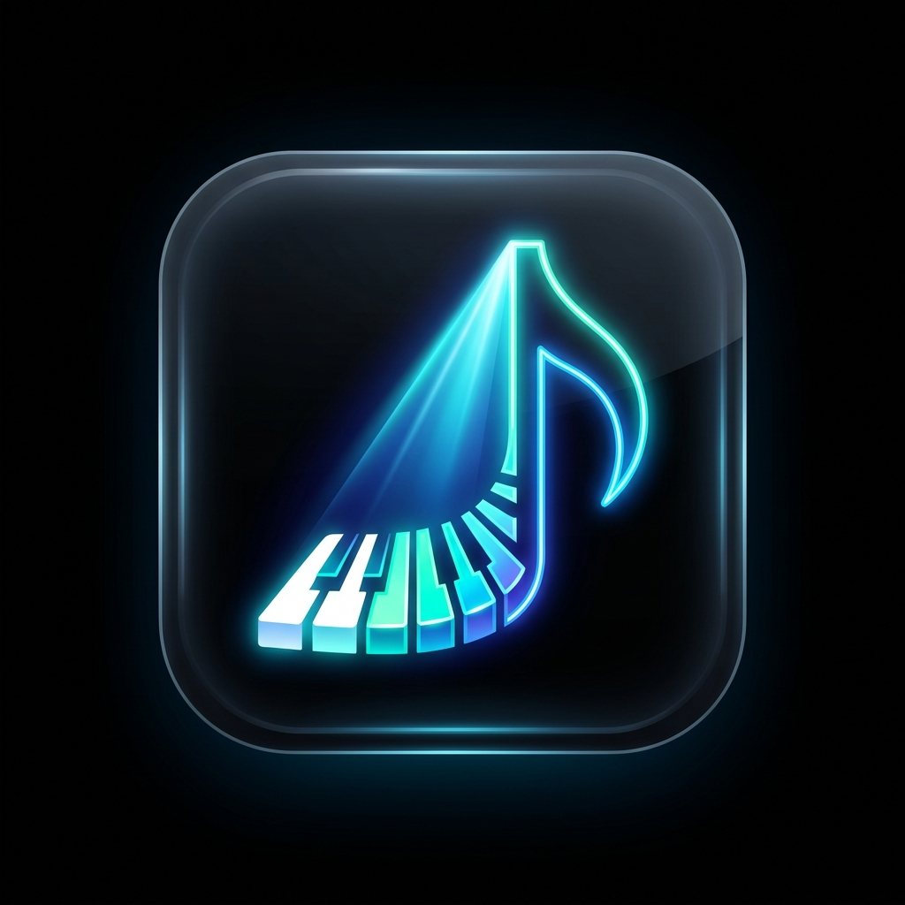

# 🎹 Open Stage Setlist

<div align="center">
  
  <h3>Modern, Distraction-Free Live Stage Setlist & Repertoire Binder for Musicians</h3>
  <p>Built specifically for live church & event keyboardists, worship teams, arrangers, and stage performers.</p>
</div>

---

## 🌟 Key Features

- **🌑 True 100% OLED Pitch Black (`#000000`)**: Zero backlight bleed on OLED stage phones and tablets, maximizing battery and stage visibility.
- **🎨 Custom Theme Creator**: Pick and preview your own custom background, surface, text, and accent colors.
- **🎹 Keyboard & Arranger HUD**: Instant cues for hardware registration banks, rhythm/style presets, tone layers, and ear-prompt melody hooks.
- **🎸 Intelligent Chord Theory & Diagrams**: Tap any chord for interactive 2-octave piano visualizers and guitar fretboard diagrams with intelligent closest-chord fallbacks (e.g. `C#m7b5`, `G/B`, `A2`).
- **☕ Live Stage Intermission & Breaks**: Dedicated stage break countdown with *"Up Next"* preview card and 1-tap resumption.
- **⚡ Hands-Free Auto-Scroll & Silent Metronome**: Configurable scroll speeds, keyboard pedal shortcuts, and silent visual tempo pulse.
- **📱 Fully Offline & Mobile-First**: Zero cloud dependency with instantaneous response on Android, iOS, tablets, and laptops.
- **📦 1-Click Markdown (.md) Export & JSON Backup**: Portable repertoire archiving and seamless data recovery.

---

## 🚀 Quick Start (Local Development)

```bash
# Clone the repository
git clone https://github.com/sajin-s-labs/open-stage-setlist.git
cd open-stage-setlist

# Install dependencies
npm install

# Start local dev server (accessible on local Wi-Fi / mobile browser)
npm run dev -- --host
```

---

## 🛠️ Tech Stack

- **Frontend**: React 19 + TypeScript + Vite
- **Icons**: Lucide React
- **Styling**: Vanilla CSS (Custom Glassmorphic Design System)
- **Zero Cloud Lock-in**: LocalStorage engine with Markdown & JSON export

---

## 📄 License

MIT License © 2026 Open Stage Setlist
